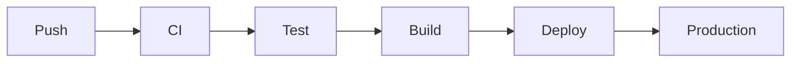

# Markdown Authoring Guide for KitesForU Viewer

> **For Claude sessions and contributors**: Follow this guide when generating markdown documents that will be viewed in `utils/markdown-viewer.html`. All syntax here is **standard markdown + standard HTML** — files will render correctly in GitHub, VS Code, Obsidian, and any CommonMark-compatible viewer. Our viewer just unlocks bonus features from patterns that are invisible elsewhere.

---

## CRITICAL: Narration Rules

> **DO NOT add `<!-- narrate: -->` comments unless the user explicitly asks for it.**

The `<!-- narrate: -->` feature exists for TTS (text-to-speech) support. While technically harmless (it's an HTML comment, invisible everywhere), **it adds tokens to the markdown source and bloats context windows**. Every narration comment is extra text that gets loaded into LLM context when reading/editing files.

**The rule is simple:**
- User says "make this listenable" / "add narration" / "TTS-friendly" → Add narration comments
- User says nothing about TTS/narration/listening → **Do NOT add them. Ever.**
- When in doubt → **Do NOT add them.**

**Future direction:** A separate post-processing layer will be built to take any standard markdown and generate a TTS-optimized version on-the-fly (adding narration for diagrams, simplifying tables for speech, etc.). This means the source markdown stays clean and lean, and the narration enrichment happens at read-time, not write-time. Until that layer exists, narration comments are opt-in only.

---

## Quick Reference

| Feature | Syntax | Standard? | Notes |
|---------|--------|-----------|-------|
| Headings | `# H1` through `###### H6` | Yes | Used for TOC, section folding, TTS sections |
| Bold/Italic | `**bold** *italic*` | Yes | |
| Strikethrough | `~~text~~` | GFM | GitHub Flavored Markdown extension |
| Highlight | `==text==` | No* | markdown-it extension; renders as `<mark>` |
| Subscript | `~text~` | No* | markdown-it extension |
| Superscript | `^text^` | No* | markdown-it extension |
| Task lists | `- [x] done` | GFM | |
| Footnotes | `text[^1]` / `[^1]: note` | Extended | Widely supported |
| Definition lists | `Term\n: Definition` | Extended | |
| Abbreviations | `*[abbr]: Full` | Extended | |
| Math inline | `$E=mc^2$` | KaTeX | Rendered by KaTeX |
| Math block | `$$..$$` | KaTeX | Rendered by KaTeX |
| Mermaid diagrams | ` ```mermaid ` | Extended | Supported by GitHub too |
| TTS narration | `<!-- narrate: text -->` | Yes (HTML comment) | **OPT-IN ONLY — see rules above** |
| Collapsible | `<details><summary>` | Yes (HTML) | Standard HTML5 |

*\* Non-standard extensions that degrade gracefully — they show as plain text in viewers that don't support them.*

---

## Heading Hierarchy

Use proper heading hierarchy. Our viewer uses headings for:
- **Table of Contents** sidebar (all H1–H6)
- **Section folding** (H1–H4 get collapse toggles)
- **TTS sections** (each heading starts a new spoken section)
- **Scroll spy** (breadcrumb shows current heading)

```markdown
# Document Title (H1 — only one per document)

## Major Section (H2 — primary structure)

### Subsection (H3)

#### Detail (H4 — last level with fold toggle)

##### Minor (H5)

###### Smallest (H6)
```

**Rules:**
- One H1 per document (the title)
- Don't skip levels (no H1 → H3)
- Keep headings concise — they appear in the TOC sidebar

---

## Links

Our viewer auto-detects link types and enhances them. Write standard markdown links:

```markdown
[Link text](https://example.com)           <!-- External — gets ↗ icon, opens new tab -->
[repo](https://github.com/org/repo)        <!-- GitHub — gets ★ icon -->
[package](https://npmjs.com/package/name)   <!-- npm — gets □ icon -->
[docs](https://docs.example.dev)            <!-- Docs — gets 📖 icon -->
[Section name](#heading-slug)               <!-- Internal — dotted underline -->
[file.md](./path/to/file.md)               <!-- File — gets 📄 icon -->
[email](mailto:user@example.com)            <!-- Email — gets ✉ icon -->
```

### Standalone link cards

When a link is the **sole content of a paragraph**, our viewer renders it as a rich card with icon, title, URL preview, and type badge:

```markdown
Check out the source:

[https://github.com/markedjs/marked](https://github.com/markedjs/marked)

See the documentation:

[https://developer.mozilla.org/en-US/docs/Web/API/SpeechSynthesis](https://developer.mozilla.org/en-US/docs/Web/API/SpeechSynthesis)
```

This is standard link syntax — in other viewers it renders as a normal clickable link.

---

## Collapsible Sections

Use standard HTML `<details>` / `<summary>` for content that should be collapsed by default:

```markdown
<details>
<summary>Click to expand: Implementation details</summary>

Any markdown content works inside:

- Lists
- **Bold text**
- `code`

</details>
```

This is standard HTML5 — works in GitHub, VS Code, and all modern browsers.

**Our viewer also adds:** heading-level folding. Every H1–H4 gets a chevron toggle that collapses all content until the next heading of same or higher level. No special syntax needed.

---

## Code Blocks

Always specify the language for syntax highlighting:

````markdown
```python
def hello():
    print("world")
```

```javascript
const hello = () => console.log("world");
```

```bash
echo "hello world"
```
````

Supported languages: `javascript`, `typescript`, `python`, `bash`, `json`, `yaml`, `css`, `html`/`xml`, `sql`, `go`, `rust`, `java`, `shell`, `dockerfile`, `markdown`.

Our viewer adds:
- Language label in the header
- Copy button

---

## Math

Use KaTeX syntax (subset of LaTeX):

```markdown
Inline: $E = mc^2$

Block:
$$\int_{0}^{\infty} e^{-x^2} dx = \frac{\sqrt{\pi}}{2}$$
```

Renders in our viewer via KaTeX. GitHub also supports `$` math. In plain viewers, shows as-is.

---

## Mermaid Diagrams

Standard mermaid code fences:

````markdown

````

GitHub also renders mermaid natively. No special syntax needed.

**If and only if the user has requested TTS/narration**, add a narrate comment before the block:

````markdown
<!-- narrate: This shows the deployment pipeline from code push through CI to production. -->


````

---

## Tables

Standard GFM tables:

```markdown
| Column A | Column B | Column C |
|----------|----------|----------|
| data 1   | data 2   | data 3   |
| data 4   | data 5   | data 6   |
```

---

## Images

```markdown

```

Our viewer adds click-to-zoom (lightbox).

---

## TTS Narration (Opt-In Only)

**Repeat: Only add these when the user explicitly requests TTS/narration/listening support.**

### How it works

`<!-- narrate: ... -->` is a standard HTML comment. Every markdown renderer either strips it or passes it through invisibly. Our viewer extracts the `narrate:` prefix content and reads it aloud during TTS playback instead of trying to read the diagram/table/image.

### Syntax

Place immediately before the block it describes:

```markdown
<!-- narrate: This flowchart shows how user requests flow through the API gateway to microservices. -->

```

### Multi-line

```markdown
<!-- narrate: This architecture diagram has three layers.
The frontend talks to the API through a load balancer.
The API layer consists of three services: auth, content, and billing.
Each service has its own database for data isolation. -->

```

### When to narrate (only if user opted in)

| Block Type | Narrate? |
|---|---|
| Mermaid diagrams | Yes — diagrams are unreadable to TTS |
| Complex tables | Yes — when data needs interpretation |
| Images | Yes — when image conveys info not in surrounding text |
| Code blocks | No — viewer says "Code block: python" and moves on |

### Writing good narrations

- Describe the structure and flow, not every visual detail
- Start with the big picture: "This diagram shows X"
- Keep it conversational — it will be spoken aloud
- Keep it short — 1-3 sentences max

### Future: Automatic narration layer

A post-processing layer is planned that will:
1. Take any standard markdown as input
2. Auto-generate narration for diagrams/tables/images at read-time
3. Feed the enriched version to the TTS engine
4. **Keep the source markdown completely clean — zero extra tokens**

This means narration will become automatic and source files will never need `<!-- narrate: -->` comments. Until this layer ships, narration is manual and opt-in.

---

## Document Structure Template

For consistent documents across the project:

```markdown
# Document Title

Brief 1-2 sentence overview of what this document covers.

## Context

Why this document exists, what problem it addresses.

## Content Sections

Main body organized with H2/H3 hierarchy.

## References

- [Related doc](./other-doc.md)
- [External resource](https://example.com)
```

---

## Compatibility Matrix

| Feature | Our Viewer | GitHub | VS Code | Obsidian |
|---------|-----------|--------|---------|----------|
| Basic markdown | Full | Full | Full | Full |
| GFM (tables, tasks) | Full | Full | Full | Full |
| `<details>` collapse | Full | Full | Full | Full |
| Mermaid | Full | Full | Plugin | Plugin |
| KaTeX math | Full | Full | Plugin | Full |
| `<!-- narrate: -->` | **TTS audio** | Hidden | Hidden | Hidden |
| Heading fold | Auto | No | No | Plugin |
| Link type detection | Auto | No | No | No |
| Link cards | Auto | No | No | No |
| Footnotes | Full | Full | Plugin | Full |
| `==highlight==` | Full | No | No | Full |
| `~sub~` / `^sup^` | Full | No | No | Full |

**Bottom line:** Stick to standard markdown + HTML. Everything degrades gracefully. The `<!-- narrate: -->` pattern is opt-in only and invisible by design.
